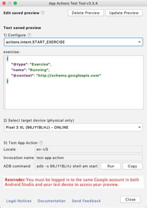

# App Actions fitness basic sample

This is a sample Fitness application that allows displaying workout information as well as starting
and stopping a workout. By implementing [App Actions](https://developers.google.com/assistant/app/),
we allow the user to call upon our application to fulfill supported
[built-in intents (BIIs)](https://developers.google.com/assistant/app/reference/built-in-intents) in the
fitness category.

Specifically, this sample supports the following BIIs:
* `actions.intent.START_EXERCISE`: Open the sample app and start an exercise session.
* `actions.intent.STOP_EXERCISE`: Open the sample app and stops the current exercise session.
* `actions.intentGET_EXERCISE_OBSERVATION`: Display a
  [Slice](https://developer.android.com/guide/slices) inside the Assistant with information on a
  particular exercise statistic.


## App Actions overview

With [App Actions](https://developers.google.com/assistant/app/), users can trigger your app through
the Google Assistant on Android devices. To support App Actions, your app must implement
[Android deep links](https://developer.android.com/training/app-links/deep-linking) to your app
content, allowing the Android system to invoke a specific Activity when the App Action is invoked.

Users invoke App Actions through phrases associated with
[built-in intents (BIIs)](https://developers.google.com/assistant/app/reference/built-in-intents).
The Assistant handles these BIIs so that your app receives the user's input without you needing to
create a conversational Action, or having to deal with natural language processing by yourself.

You map the BIIs that are relevant to your app and their parameters to your Android deep links
in a file named `actions.xml`. For more details, check out the
[App Actions developer documentation](https://developers.google.com/assistant/app/overview).

## Importing this sample

Check out or download the project to your preferred location. You can import the project using the
Android Studio with the following steps:

1. Select **Open an existing Android Studio project** from the initial screen, or go to
   **File > Open**.
2. Find the directory where you saved the sample.
3. Select the `build.gradle` file.
4. Follow the instructions presented by the IDE.

## Requirements

The App Actions feature is in Developer Preview, so running the sample or using App Actions in
another app requires a few extra steps.

The `actions.xml` file that defines the supported actions for your app (or in this case the sample), 
needs to be uploaded for the Assistant. This is done using the
[App Actions test tool](https://developers.google.com/assistant/app/test-tool) Android Studio
plugin (installation instructions are listed below).

For security and verification reasons, when uploading the `actions.xml` file with the plugin, the
account used must have ownership of the application ID.

[Sign in to Android Studio](https://developer.android.com/studio/intro#sign-in) with your account
and use the applicationId of one of your published apps in Google Play Console. If you don't have
any existing apps, you can upload one in draft mode (it doesn't have to be published to production).

Change the `applicationId` in [app/build.gradle](https://github.com/actions-on-google/appactions-fitness-kotlin/blob/e83ed77b02fe056f767f2da5f0bbe5bd5b23f95c/app/build.gradle#L31)
```groovy
android {
    defaultConfig {
        applicationId "com.devrel.android.fitactions" // Use one of your published applications IDs
    }
}
``` 

Also, [Google Assistant](https://assistant.google.com/) must be installed on the test/target device 
with the same account used in Android Studio.

Finally, the sample shows how to use the Firebase App Indexing to track the success or failure of the 
actions received. Re-use or create an app in Firebase following 
[these steps](https://firebase.google.com/docs/android/setup) and make sure `google-services.json`
is available in the app module.

Note: As an alternative, if you want to skip this step, you can disable Firebase by setting the
`firebaseEnabled` flag to false in [app/build.gradle](app/build.gradle).

## How to run

Once the requirements above are satisfied, you are ready to run the sample.

1. Run the code and install the sample in the device (Run `app`).
2. Open the App Actions plugin (**Tools > App Actions Test Tool**).
3. Define an invocation name to use for triggering the actions (like "My Fit App").
4. Click **Create Preview**. If the setup was successful, you will see a panel like this:



5. Select the action and click **Run**.

The Assistant should show up and run the selected action.

Once you run this once, you can then try using voice or written commands directly in the 
Assistant on the device.

### Installing the App Actions test tool

1. If you use Linux or Windows, go to **File > Settings**. For MacOS, go to
   **Android Studio > Preferences**.
2. Select the **Plugins** section.
3. Search for "**App Actions Test Tool**".
4. Click **Install** and restart your IDE.

## Troubleshooting

Make sure that you follow these steps:

* Own a Google account
* Application ID used is published in Google Play console (at least as draft)
* Google Account has access to the application in Google Play Console
* Logged in Android Studio with the Google Account
* Logged in with the same account in the testing device
* Actions.xml file is defined in the Application project
* Upload preview using App Actions plugin
* App is available in the device.

If the plugin is not able to load the preview of the action, make sure that:
 
* The account used in Android Studio is the same as the one in the device.
* The account used must own or have access in Play console to the applicationId defined
in `build.gradle`.
* Android Studio has access to an internet connection.
* If you modified the `actions.xml`, make sure the right syntax is used.

If the action is not running in the device or Assistant is not reacting, make sure that:

* The plugin loaded the actions preview at least one time.
* The account in the device is the same as the one in Android Studio.
* The device has access to an internet connection.
* You are using the latest version of the Assistant or Google app. 

App Actions is in Developer Preview, so you can't upload an application to Google Play that
defines actions in the `AndroidManifest.xml`. Remove the metadata tag to upload it:

```xml
<meta-data
    android:name="com.google.android.actions"
    android:resource="@xml/actions" />
```

If project does not compile after changing the applicationId, the main reason is GoogleService
plugin:

```
FAILURE: Build failed with an exception.

* What went wrong:
Execution failed for task ':app:processDebugGoogleServices'.
> No matching client found for package name 'com.name.package'
```

Check the requirement section, you must update the JSON file or disable the plugin.

If instead the problem is that the app is not being installed, showing this error:
```
Installation did not succeed.
The application could not be installed: INSTALL_FAILED_CONFLICTING_PROVIDER
Installation failed due to: 'null'
```

It's because you have installed the sample version without changing the applicaitonId and
the authority for the SliceProvider are conflicting when trying to install the new one with
different ID.

* Change the authority of SliceProvider in `AndroidManifest.xml`, in `actions.xml`, and in
  `FitSliceProvider.kt`.
* Or uninstall the sample and install again with the new applicationId. 

Last but not least, remember to update the preview in the App Actions plugin every time
you change `actions.xml`. Just running the app won't apply the changes.

## License
```
Copyright 2019 Google LLC

Licensed under the Apache License, Version 2.0 (the "License");
you may not use this file except in compliance with the License.
You may obtain a copy of the License at

   https://www.apache.org/licenses/LICENSE-2.0

Unless required by applicable law or agreed to in writing, software
distributed under the License is distributed on an "AS IS" BASIS,
WITHOUT WARRANTIES OR CONDITIONS OF ANY KIND, either express or implied.
See the License for the specific language governing permissions and
limitations under the License.
```
